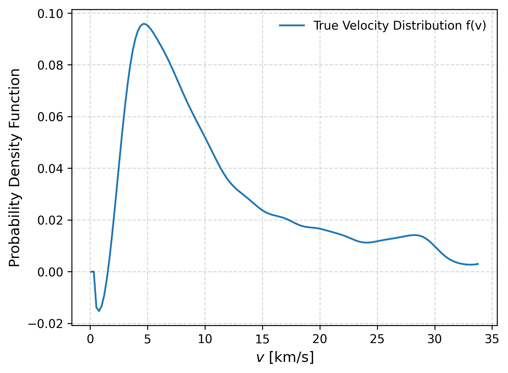

# Distribution of True Stellar Rotational Velocities

This project contains code and data to analyze and visualize the distribution of true stellar rotational velocities (v) based on observed projected rotational velocities (v sin i).

## Introduction
All the stars rotate around their own axis, and the measurement of their rotational velocity is essential to understand many stellar properties and phenomena. However, what we can directly observe is the projected rotational velocity ($v \sin i$), where '$i$' is the inclination angle between the star's rotation axis and the line of sight. 

The true rotational velocity ($v$) can be inferred from $v \sin i$, but this requires statistical methods due to complex observational techniques to measure the inclination angle.

CHandrasekhar & Münch (1950) derived an integral equation that relates the distribution of true rotational velocities ($f_X(x)$) to the distribution of projected rotational velocities ($f_Y(y)$) under the assumption of an isotropic distribution of stellar rotation axes.

$$f_Y(y) = \int_y^{\infty} \frac{y}{x}\frac{1}{\sqrt{x^2-y^2}} f_X(x)\, dx$$

where $y = v \sin i$ and $x = v$. The analytical solution to this equation was provided by Chandrasekhar & Münch (1950) as:

$$f_X(x) = -\frac{2}{\pi} x^2 \frac{\partial}{\partial x} \left[ x \int_x^{\infty} \frac{1}{y^2 \sqrt{y^2 - x^2}} f_Y(y) \, dy \right]$$

however, this solution is numerically unstable due to the derivative term.

In 2017 Corsaro et al. found evidence of spin alignment in stars within old open clusters, suggesting a non-isotropic distribution of stellar rotation axes. The stellar spin axis are not randomly oriented, but rather show a preferred direction. Two stellar cluster were analyzed: NGC 6791 and NGC 6819 , finding a high degree of alignment among the stars' rotation axes not explained by an isotropic distribution.

Solar M. (2021) based on the work of Christen et al. (2016) proposed an alternative method to recover the distribution of true rotational velocities using an $\alpha$-parametric kernel approach, allowing for non-isotropic distributions of stellar rotation axes. In this method, the integral equation is modified to include a parameter $\alpha$ that characterizes the degree of anisotropy in the distribution of stellar rotation axes:

$$f_Y(y;\alpha) = c_\alpha \int_y^\infty \frac{y^{2\alpha+1}}{x^{2\alpha+1}}\frac{1}{\sqrt{x^{2}-y^2}} f_X(x;\alpha) \, dx$$

where $\displaystyle{c_\alpha = \frac{\sqrt{\pi} \Gamma(\alpha + 1)}{\Gamma(\alpha + 3/2)}}$ is a normalization constant dependent on $\alpha$. The case $\alpha = 0$ corresponds to the isotropic distribution, and different values of $\alpha$ represent varying degrees of anisotropy. The analytical solution for this modified integral equation is given by:

$$f_X(x;\alpha) = - \frac{2}{\pi c_\alpha} \int_x^{\infty} \frac{x^{2\alpha+1}}{y^{2\alpha+1}}\frac{1}{x^{2}}\left(y\frac{d}{dy}f_Y(y;\alpha)-(1+2\alpha)f_Y(y;\alpha) \right) \,  dy$$

But similarly to the Chandrasekhar & Münch (1950) solution, this expression is numerically unstable due to the derivative term. 

The value of $\alpha$ affects the distribution of projected rotational velocities, as shown in the figure below:

In general, if $\alpha = 0$, the distribution of stellar rotation axes is isotropic. If $\alpha > 0$, there is a tendency for the rotation axes to align in a preferred direction, while if $\alpha < 0$, the rotation axes tend to be perpendicular to that direction.

A way to solver this equation is used the matrix formulation of the Fredholm integral equation of the first kind, which can be expressed as:

$$\mathbf{Y} = \mathbf{K} \cdot \mathbf{X}$$

where $\mathbf{Y} \equiv f_Y(y;\alpha)$ is the vector of observed projected rotational velocities, $\mathbf{X}\equiv f_X(x;\alpha)$ is the vector of true rotational velocities to be estimated, and $\mathbf{K}$ is the kernel matrix derived from the integral equation. In this formulation, the problem reduces to solving a system of linear equations. However, this system is often ill-posed, leading to numerical instability and sensitivity to noise in the data.

We propuse use a decolvolutional method using Tikhonov regularization to solve this ill-posed problem, also called Ridge regularization. Tikhonov regularization adds a penalty term to the solution, which helps stabilize the inversion process and reduces the impact of noise. The regularized solution can be expressed as:

$$\mathbf{X}_{\text{reg}} = \arg\min_{\mathbf{X}} \left (|| \mathbf{K} \cdot \mathbf{X} - \mathbf{Y} ||^2 + \lambda^2 || \mathbf{L} \cdot \mathbf{X} ||^2 \right)$$

where $\lambda$ is the regularization parameter that controls the trade-off between fitting the data and smoothing the solution, and $\mathbf{L}$ is a regularization matrix (often chosen as the identity matrix or a derivative operator). The choice of $\lambda$ is crucial, as it determines the balance between fidelity to the observed data and the smoothness of the estimated distribution.

For obtain de distribution of true rotational velocities, a simmetric kernel was used, a Gaussian kernel, defined as:

$$\hat f_h(x) = \frac{1}{nh}\sum_{i=1}^n \frac{1}{\sqrt{2\pi}}\exp\left({-\frac{\left(x-x_i \right)^2}{2h^2} }\right) $$

where $h$ is the bandwidth parameter that controls the width of the kernel. The choice of $h$ affects the smoothness of the estimated distribution, with larger values leading to smoother estimates and smaller values capturing more details but potentially introducing noise.

Our distribution will be point estimated using the Silverman's rule of thumb for bandwidth selection.

The metric used to evaluate the goodness of fit between the observed and estimated distributions to find the best $\alpha$-value is the Root Mean Square Error (RMSE), defined as:

$$\text{RMSE} = \sqrt{\frac{1}{n} \sum_{i=1}^n \left( f_Y(y_i;\alpha) - \hat{f}_Y(y_i;\alpha) \right)^2}$$

where $f_Y(y_i;\alpha)$ is the observed distribution of projected rotational velocities, and $\hat{f}_Y(y_i;\alpha)$ is the estimated distribution obtained from the deconvolution process for a given $\alpha$.

## Objective
Recover the Distribution of True Stellar Rotational Velocities ($v \equiv f_X(x)$) from the Distribution of Projected Rotational Velocities ($v \sin i$) using the alternative method with an $\alpha$-parametric kernel approach proposed in Solar, M. (2021) and Christen, A. et al. (2016). Using Tikhonov regularization to solve the integral equation that relates both distributions. 

## Results

This method was first applied to field stars from the Geneva-Copenhagen survey (Holmberg et al., 2009), which contains a sample of 11818 F and G dwarf stars in the solar neighborhood with measured projected rotational velocities ($v \sin i$). The best-fit value of $\alpha$ was found to be $\alpha = 0$, indicating an isotropic distribution of stellar rotation axes.

    Geneve-Copenhagen Survey Field Stars Results
    
    

After the same procedure was applied to stars in the open clusters Alpha Persei and Pleidaes, the best-fit value of $\alpha$. Obtained the next results:

## Conclusions
- In the cases of Field Stars the value of $\alpha = 0$ was obtianed, indicating that the distribution of true rotational velocities is consistent with an isotropic distribution of stellar rotation axes. This result aligns with previous studies such as Chandrasekhar & Münch (1950).

- In the case of Star Cluster members, a value of $\alpha \neq 0.5$ was obtained, suggesting a non-isotropic distribution of stellar rotation axes. This finding is consistent with the results reported by Corsaro E. et al. (2017) and Solar M. (2021), who found evidence of spin alignment in stars within old open clusters.

## References
- Chandrasekhar, S., & Münch, G. (1950). On the integral equation governing the distribution of the true and the apparent rotational velocities of stars. The Astrophysical Journal, 111, 142. https://doi.org/10.1086/145245

- Christen, A., Escarate, P., Curé, M., Rial, D. F., & Cassetti, J. (2016). A method to deconvolve stellar rotational velocities II. The probability distribution function via Tikhonov regularization. Astronomy & Astrophysics, 595, A50. https://doi.org/10.1051/0004-6361/201629070

- Corsaro, E., Lee, Y.-N., García, R. A., Hennebelle, P., Mathur, S., Beck, P. G., Mathis, S., Stello, D., & Bouvier, J. (2017). Spin alignment of stars in old open clusters. Nature Astronomy, 1, 0064. https://doi.org/10.1038/s41550-017-0064

- Holmberg, J., Nordström, B., & Andersen, J. (2009). The Geneva-Copenhagen survey of the solar neighbourhood. III. Improved distances, ages, and kinematics. Astronomy & Astrophysics, 501(3), 941–947. https://doi.org/10.1051/0004-6361/200811191

- Solar, M. (2021). Non-isotropic distributions of stellar rotational velocities [Tesis de magíster no publicada, Universidad de Valparaíso]. Repositorio Institucional UV. https://repositoriobibliotecas.uv.cl/items/7c463ec8-453b-42b3-ab49-9fd2b2961a6a/full

